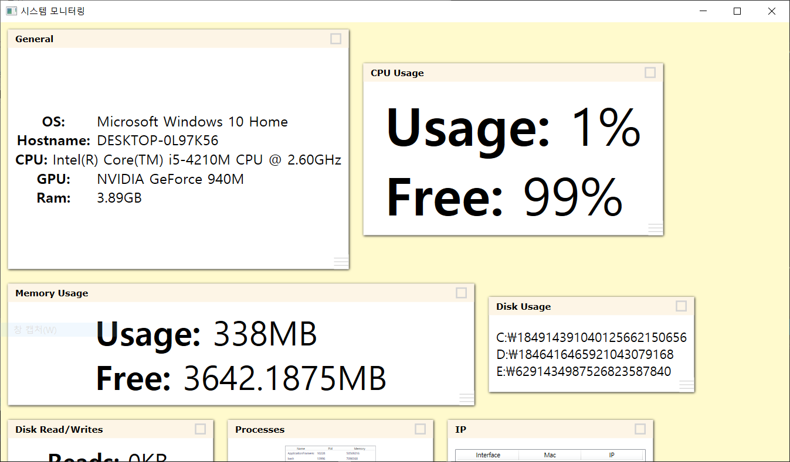

# PC-monitoring

## 내 PC정보를 실시간으로 모니터링 하는 시스템

### 모니터링 정보
- OS, CPU, GPU 등의 기본정보
- CPU, 메모리 사용량과 남은량
- 마운트된 디스크 목록과 전체용량, 남은용량
- 디스크 읽기 쓰기
- 프로세스 목록
- 네트워크 어댑터

 초기화면

각 Card형태의 패널은 우측 하단을 선택해 크기 동적으로 조절 가능
